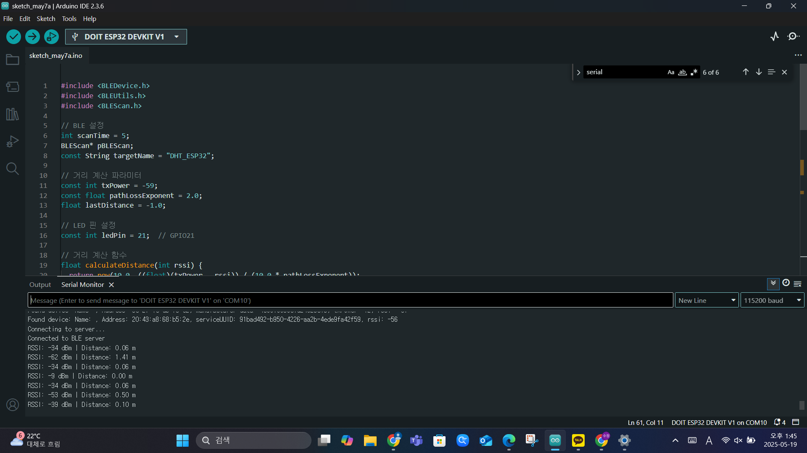
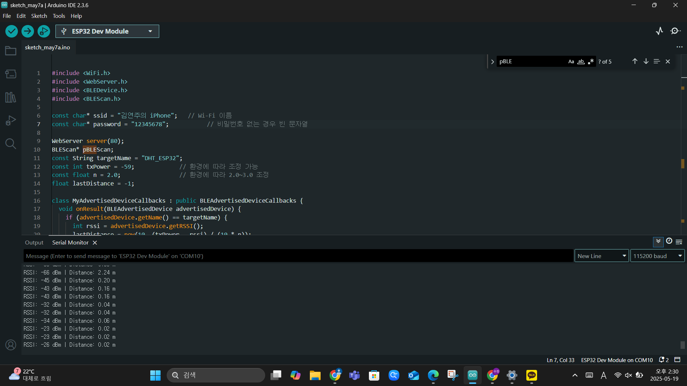
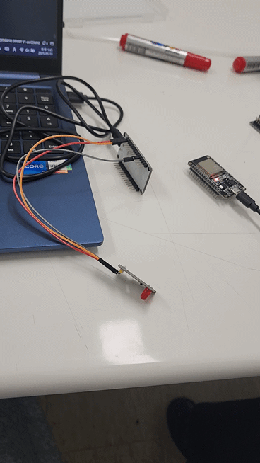
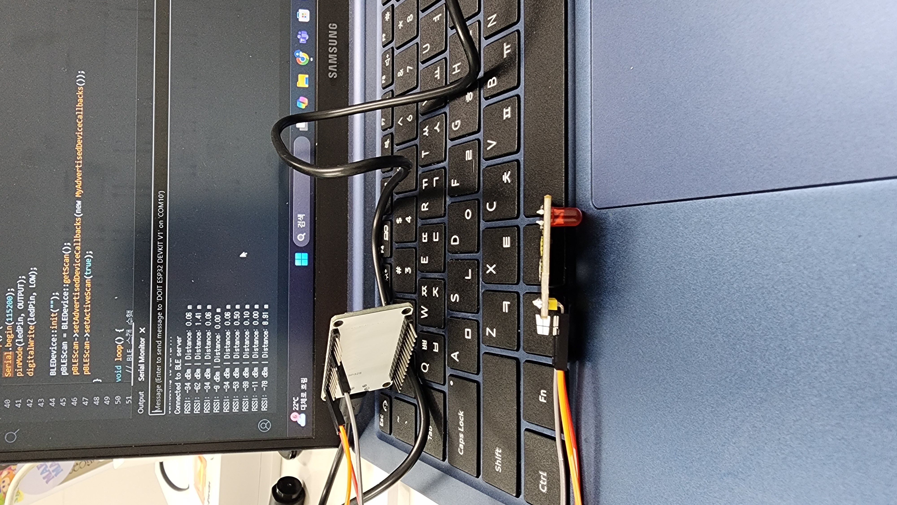
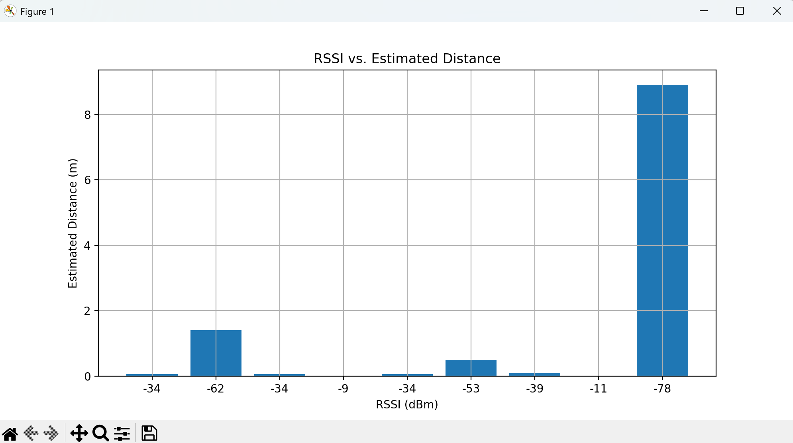
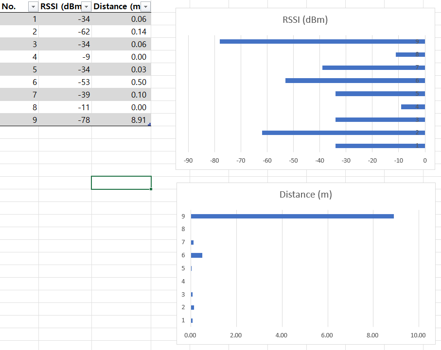

# IoT25-HW07
This project is to calculate the distance using RSSI. 
We measured the BLE signal strength and used ```pow(10.0, ((float)(txPower - rssi)) / (10.0 * pathLossExponent));``` to calculate the distance between the two ESP32 devices. 
And additionally, we implemented the function that **the LED blinks** when the distance is less than 1m and the distance information is **displayed on the web server**.

- Photos/videos of the experiment
  
  
  
  
  
  

- Table and bar chart of results
  
  
